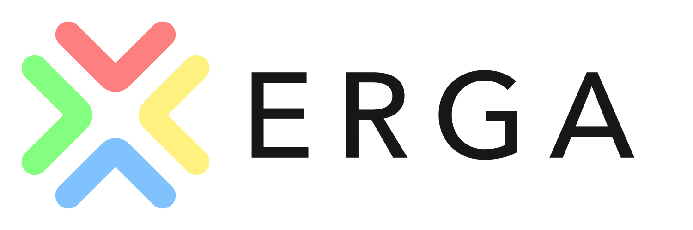

<div align="center">
  

  <p>
    <a href="https://github.com/Adr1an04/erga-mcp/actions/workflows/ci.yml"></a>
    <a href="https://www.python.org/"></a>
    <a href="LICENSE"></a>
    
  </p>

  <p>
    <a href="#quick-start">Quick start</a> ·
    <a href="#how-erga-works">How it works</a> ·
    <a href="docs/getting-started.md">Documentation</a> ·
    <a href="CONTRIBUTING.md">Contributing</a>
  </p>
</div>

---

Recruiting is hard for students and full-time engineers. Applications pile up, job descriptions
disappear, recruiter updates get buried in your inbox, and every role asks for a slightly different
version of the same résumé.

Erga helps you keep that mess organized. It tracks your applications, saves the job information
and recruiting updates that matter, and prepares a tailored version of your résumé for each role.
It is built around LaTeX résumé workflows and is designed to work cleanly with templates such as
[Jake's Resume](https://www.overleaf.com/latex/templates/jakes-resume/syzfjbzwjncs). Your original
résumé stays untouched; Erga creates a separate `.tex` file, a readable diff, and a PDF for you to
review.

You can use Erga directly from the command line or connect it to an MCP client such as Hermes. Its
application records and generated files stay on your computer.

> [!IMPORTANT]
> Erga organizes the process, but it does not submit applications, send messages, invent résumé
> claims, modify your inbox, or overwrite your original résumé.

## What Erga does

- Keep your applications and status history in one local database.
- Save job postings before they disappear.
- Create a separate folder and tailored résumé for each role.
- Reorder existing résumé bullets, projects, and skills to better match a job description.
- Compile the result to a PDF and show exactly what changed.
- Read limited Gmail or Zoho metadata to spot interviews, assessments, offers, and rejections.
- Use the same tools from the CLI or an MCP client.

Erga does not fill out forms or submit applications. Resume tailoring only uses content already in
your template or facts you added yourself.

## Quick start

### Requirements

- Python 3.11 or newer
- [`uv`](https://docs.astral.sh/uv/)
- Git

Optional workflows use `latexmk`, an existing LaTeX résumé, a supported operating-system
credential store, or an authenticated [`gws`](https://github.com/googleworkspace/cli) command.

### Install

```bash
git clone https://github.com/Adr1an04/erga-mcp.git
cd erga-mcp
uv sync --extra mcp
```

Initialize a private local workspace and verify the installation:

```bash
uv run erga init
uv run erga doctor
```

By default Erga creates:

```text
~/.config/erga-mcp/
├── config.toml
└── state/
    └── erga.sqlite3
```

The configuration contains paths and feature settings, never credentials. Use
`--config /absolute/path/to/config.toml` to select another location.

### Add evidence and a draft application

```bash
uv run erga evidence add \
  --source-ref 'Career.md#Pipeline project' \
  --text 'Built a Python pipeline that reduced weekly manual review by 30%.' \
  --approved
```

Use the returned evidence ID to create a local draft:

```bash
uv run erga applications add \
  --company 'Example Company' \
  --role 'Software Engineer' \
  --source-url 'https://jobs.example.com/123' \
  --evidence-id 'ev_a1b2...'
```

Nothing is sent to the employer. Check local state with:

```bash
uv run erga status
uv run erga applications list
```

For résumé setup, mail connectors, job-link routing, and scheduled private alerts, continue with
the [complete getting-started guide](docs/getting-started.md).

## MCP and Hermes

Install the optional MCP dependencies, then register the local stdio server:

```bash
uv sync --extra mcp

hermes mcp add erga-mcp \
  --command uv \
  --connect-timeout 30 \
  --env ERGA_MCP_CONFIG=/absolute/path/to/config.toml \
  --args --directory /absolute/path/to/erga-mcp run erga-mcp
```

`--args` must remain last. If the gateway routes the chat through a named Hermes profile, add the
same profile flag to MCP and plugin commands (for example, `hermes --profile coder mcp add ...`).
See [`integrations/hermes/mcp.example.yaml`](integrations/hermes/mcp.example.yaml) for the equivalent
configuration file.

Core MCP tools include:

| Tool | Behavior |
| --- | --- |
| `pipeline_status` | Read local record counts |
| `list_applications` | Read local application records |
| `application_tracker` | Render the configured local Obsidian tracker as a compact, read-only message card |
| `list_evidence` | Read local evidence records |
| `list_mail_events` | Read normalized local mail events |
| `intake_job_url` | Research one job and build local review artifacts end to end |
| `prepare_job_workspace` | Create a bounded local job package from a supplied URL |
| `create_tailored_resume` | Create a proposal, diff, and evidence report |
| `validate_tailored_resume` | Run the configured local LaTeX compiler |
| `install_mail_monitor_scripts` | Prepare deterministic Hermes notification runners |
| `export_data` | Build a private ZIP of local records and generated packages |

With the optional `erga-mcp-router` Hermes plugin enabled, `/erga-tracker` renders that same local Obsidian tracker directly in the current chat. The output is compact Markdown so it remains readable across Discord, Signal, Telegram, Slack, and other Hermes platforms; it does not write to the vault or expose posting URLs.

The full list of permissions and safety limits is in [`docs/security.md`](docs/security.md).

## Repository map

```text
src/erga_mcp/          deterministic domain layer, CLI, and MCP server
integrations/hermes/  optional Hermes configuration and router plugin
skills/productivity/  optional workflow skill
cron/                 private notification runner documentation
docs/                 architecture, security, setup, and project direction
tests/                synthetic unit and MCP integration tests
```

## Documentation

- [`docs/getting-started.md`](docs/getting-started.md) — full setup.
- [`docs/security.md`](docs/security.md) — permissions and safety details.
- [`docs/FUTURE.md`](docs/FUTURE.md) — ideas for later.
- [`CONTRIBUTING.md`](CONTRIBUTING.md) — how to run checks and contribute.

## Project status

Erga MCP is **pre-alpha**. The evidence ledger, local application store, deterministic mail
classification, job workspace creation, LaTeX proposal artifacts, read-only mail connectors, and
MCP surface are implemented and tested. Breaking changes are expected before 1.0.

Current limitations:

- no graphical interface;
- no automatic matching between mail events and application records;
- imported Obsidian candidates cannot yet be approved through the CLI;
- relevance ranking is lexical rather than semantic;
- résumé workflows currently target LaTeX; and
- no remote résumé synchronization or automatic job submission by design.

## Development

```bash
uv sync --extra mcp --extra dev
uv run ruff format --check .
uv run ruff check .
uv run mypy src
uv run python -m unittest discover -s tests -v
uv build
git diff --check
```

Tests and examples use synthetic data. Never commit real résumés, applications, email content,
credentials, contact details, exports, or vault contents.

## Contributing

Issues and pull requests are welcome. Read [`CONTRIBUTING.md`](CONTRIBUTING.md), follow the
[`CODE_OF_CONDUCT.md`](CODE_OF_CONDUCT.md), and use private vulnerability reporting described in
[`SECURITY.md`](SECURITY.md).

## License

Erga MCP is available under the [MIT License](LICENSE).
